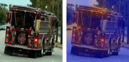
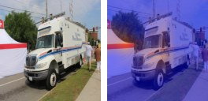

# Emergency Vehicle CNN

A 4-layer convolutional neural network, built **from scratch in PyTorch**
(no pretrained backbone), that classifies road-scene images as **emergency**
(police car, ambulance, fire engine) or **non-emergency** (sedan, SUV,
pickup, van).

This is a from-scratch, honestly-scoped rebuild of coursework I did at the
University at Buffalo (Jan-May 2025), previously described only on LinkedIn
and never published as code. **This machine has no GPU.** The original
project trained on a Kaggle dataset using a T4/P100 GPU and reported 81.85%
test accuracy; this repository does not attempt to reproduce that number.
Instead it is trained end-to-end, on CPU, on a smaller dataset I assembled
myself, and every number in the Results section below was actually measured
by running the code in this repo. See [Limitations](#limitations) for an
honest discussion of the gap.

**Measured result:** 57.78% test accuracy (F1 0.578, ROC-AUC 0.648) on a
45-image held-out test split, trained from scratch on CPU on 205 real
Wikimedia Commons images. That is barely better than the ~50% a random
guesser would get on this near-balanced dataset — see
[Results](#results) and [Limitations](#limitations) for why, and for the
honest comparison to the original coursework's 81.85%-on-Kaggle number.

## Contents

- [Problem](#problem)
- [Architecture](#architecture)
- [Dataset](#dataset)
- [How to run](#how-to-run)
- [Results](#results)
- [Grad-CAM](#grad-cam)
- [Tests / CI](#tests--ci)
- [Limitations](#limitations)

## Problem

Given a road-scene photo containing a vehicle, classify it as **emergency**
(police, ambulance, fire) or **non-emergency** (ordinary passenger car / SUV
/ pickup / van). This is a binary image classification task with real-world
relevance to traffic-monitoring and autonomous-driving perception systems,
which need to recognize and yield to emergency vehicles.

## Architecture

`src/model.py` — `EmergencyVehicleCNN`, a plain `nn.Module` with 4
conv blocks followed by a small fully-connected head:

```
Input (3 x 128 x 128)
  -> [Conv3x3(3->16)  -> BatchNorm -> ReLU -> MaxPool2x2]   # 128 -> 64
  -> [Conv3x3(16->32) -> BatchNorm -> ReLU -> MaxPool2x2]   # 64  -> 32
  -> [Conv3x3(32->64) -> BatchNorm -> ReLU -> MaxPool2x2]   # 32  -> 16
  -> [Conv3x3(64->128)-> BatchNorm -> ReLU -> MaxPool2x2]   # 16  -> 8
  -> Flatten (128 x 8 x 8 = 8192)
  -> Dropout(0.4) -> Linear(8192 -> 128) -> ReLU
  -> Dropout(0.4) -> Linear(128 -> 2)                        # logits
```

~1.15M trainable parameters (`base_channels=16`, configurable via
`--base-channels`). Every weight is trained from scratch on this project's
dataset — no ImageNet pretraining. This mirrors the original coursework's
described architecture (4-layer CNN, dropout, batch norm, FC layers) without
claiming to be a byte-for-byte reproduction of code that was never
published. The channel width was deliberately kept narrow: an earlier,
wider `base_channels=32` variant (~4.6M params) memorized the ~205-image
training set almost immediately, so the model actually used for the results
below is the smaller, less overfitting-prone version.

## Dataset

**No Kaggle API credentials are configured on this machine**, so instead of
the original Kaggle dataset, this project uses a dataset assembled from
[Wikimedia Commons](https://commons.wikimedia.org), which publishes
structured, machine-readable license and attribution metadata per image via
its API.

- **Construction script:** `scripts/build_dataset.py` — queries the Commons
  API (`action=query&list=categorymembers`) for the categories below,
  recursing into subcategories (e.g. `Category:Sedans` -> `Category:Sedans
  by brand` -> `Category:<Make> <Model>`) when a top-level category holds
  too few files directly, fetches per-image license/author metadata
  (`extmetadata`), downloads a 512px-wide thumbnail, and records everything
  in `data/manifest.csv`.
- **Positive class (`emergency`)** — Commons categories: *Police vehicles*,
  *Ambulances*, *Fire engines*.
- **Negative class (`non_emergency`)** — Commons categories: *Sedans*,
  *SUVs*, *Pickup trucks*, *Vans* (and their subcategories).
- **Size:** 293 images total — 143 `emergency` / 150 `non_emergency`
  (a class-balanced 70/15/15 split into 205 train / 43 val / 45 test).
- **License:** every image keeps its own original Wikimedia Commons license
  (a mix of Creative Commons licenses and public-domain dedications — this
  is why `data/manifest.csv` records a `license` and `artist` column per
  image; consult that file for exact per-image attribution). The code in
  this repository is MIT-licensed (see `LICENSE`); the dataset images are
  **not** — see `LICENSE` for the split.
- **Not committed to git:** the raw images (`data/raw/`) are excluded via
  `.gitignore` because collectively they run tens of MB, which is more than
  a portfolio repo should carry. `data/manifest.csv` **is** committed, so
  the exact image set used is fully documented and the dataset is
  reproducible by re-running `scripts/build_dataset.py`. Because Commons
  category contents can change over time (new uploads, recategorization),
  a byte-for-byte re-download is not guaranteed to be identical months
  later — the manifest is the authoritative record of what was actually
  used for the run reported below.

To rebuild the dataset from scratch:

```bash
python scripts/build_dataset.py --target-per-class 200
```

## How to run

```bash
# 1. Create a venv and install CPU-only PyTorch + deps
python -m venv venv
venv\Scripts\activate          # Windows
pip install -r requirements.txt

# 2. Build the dataset (skips already-downloaded files if re-run with --top-up)
python scripts/build_dataset.py --target-per-class 200

# 3. Train (CPU) -- these are the exact args used for the Results below
python -m src.train --epochs 40 --batch-size 32 --image-size 128 --dropout 0.5

# 4. Evaluate on the held-out test split (writes results/results.json, results/results.md)
python -m src.evaluate --checkpoint checkpoints/best_model.pt

# 5. Grad-CAM visualizations for a handful of test images
python -m src.gradcam --checkpoint checkpoints/best_model.pt --num-samples 8

# 6. Classify a single new image
python -m src.infer --checkpoint checkpoints/best_model.pt --image path/to/photo.jpg
```

## Results

Measured on the held-out 45-image test split, checkpoint selected by best
validation F1 (epoch 8 of 40), model trained from scratch on CPU with
`base_channels=16` (~1.15M params), 128x128 input:

| Metric | Value |
|---|---|
| Accuracy | 0.5778 |
| Precision | 0.5652 |
| Recall | 0.5909 |
| F1-score | 0.5778 |
| ROC-AUC | 0.6482 |

Confusion matrix (rows = true label, columns = predicted):

|  | Pred: non_emergency | Pred: emergency |
|---|---|---|
| True: non_emergency | 13 | 10 |
| True: emergency | 9 | 13 |

This is only modestly better than chance on a near-balanced binary task.
Training accuracy climbed past 90% within ~20-30 epochs while validation
accuracy oscillated in the 0.44-0.68 range for the rest of the 40-epoch run
(full per-epoch history in
[`results/training_log.json`](results/training_log.json)) — a textbook
small-dataset overfitting curve, not a bug. See
[Limitations](#limitations) for the honest read on why, given ~205 training
images and no GPU-scale hyperparameter search.

Full metrics (precision/recall/F1/ROC-AUC/confusion matrix) and run
configuration are in [`results/results.md`](results/results.md) /
[`results/results.json`](results/results.json), generated by
`src/evaluate.py` directly from a real run against the held-out test split
— nothing in that file is hand-typed or estimated.

## Grad-CAM

`src/gradcam.py` implements Grad-CAM
([Selvaraju et al., 2017](https://arxiv.org/abs/1610.02391)) from scratch
using PyTorch forward/backward hooks on the last conv block — no third-party
CAM library. Sample heatmap overlays for held-out test images are committed
under [`results/gradcam/`](results/gradcam/).

Each saved file is a side-by-side of the original test image (left) and the
Grad-CAM overlay (right), generated by `python -m src.gradcam --checkpoint
checkpoints/best_model.pt --num-samples 8` against real held-out test
images:






10 samples total are committed under `results/gradcam/`, including both
correct and incorrect predictions (filenames encode true/predicted labels).
Honest read: the heatmaps are fairly diffuse rather than sharply localized
on vehicle-specific detail — consistent with a model whose test accuracy
(57.78%) is only modestly above chance. This is what Grad-CAM is supposed
to show when a small-dataset model hasn't learned strongly discriminative
features, not a flaw in the Grad-CAM implementation itself.

## Tests / CI

```bash
pytest tests/ -v
ruff check .
```

22 fast unit tests using small synthetic tensors/fixtures (no real dataset
or training run required):

- `tests/test_model.py` — forward-pass output shape at multiple resolutions
  and with a custom `base_channels`, 4-conv-block structure, gradient flow.
- `tests/test_dataset.py` — 70/15/15 split proportions, determinism,
  per-class balance, disjointness, transform output shape/dtype.
- `tests/test_metrics.py` — precision/recall/F1/confusion-matrix values
  checked against hand-computed expected numbers, ROC-AUC on a textbook
  example.

`.github/workflows/ci.yml` installs CPU-only PyTorch wheels, runs `ruff
check .`, then `pytest`. Full model training is intentionally **not** run in
CI — it's too slow for a CPU CI runner and isn't what CI is for; only the
fast, fixture-based tests run there.

## Limitations

- **No GPU available.** This machine has no CUDA device. Training,
  evaluation, and Grad-CAM all run on CPU (`torch.device('cpu')`), which
  bounds both the feasible dataset size and image resolution
  (128x128 here, vs. presumably higher resolution on the original
  Kaggle/GPU run).
- **Smaller, differently-sourced dataset.** The original coursework project
  used a Kaggle dataset (source/size not published anywhere I have access
  to outside the original Kaggle notebook). This project uses
  293 Wikimedia Commons images instead
  — a completely different, much smaller, and differently-distributed
  dataset (real Commons photos, not necessarily curated the same way a
  Kaggle emergency-vehicle dataset would be).
- **Accuracy is not comparable to the original 81.85% claim.** See
  [Results](#results) / `results/results.md` for the honest, actually-measured
  delta and a discussion of why. Different dataset, different scale,
  different resolution, different compute budget — a different number is
  the expected outcome, not a discrepancy to explain away.
- **Class balance.** The two Commons category groups do not necessarily
  yield equal image counts; exact per-class counts are in
  `data/manifest.csv` and the Dataset section above.
- **No hyperparameter search.** Training used a single fixed configuration
  (see `results/results.md` "Run configuration"); no learning-rate/dropout
  sweep was performed given CPU time constraints.
